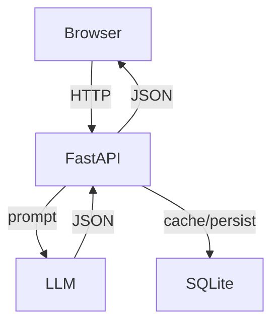
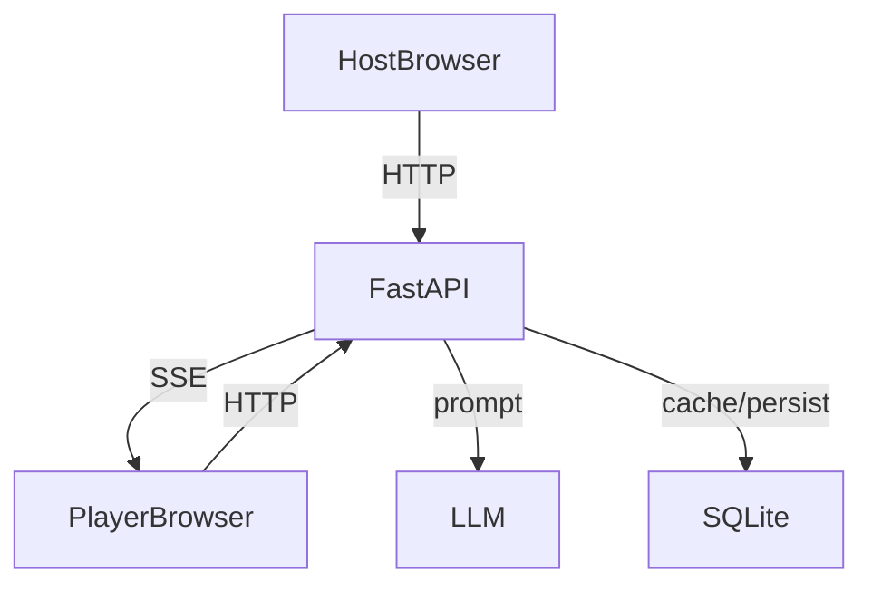

# Architecture

## High-Level Components
- **Frontend** (templates + JS modules): renders UI, manages client state, calls the API.
- **Backend** (FastAPI): serves templates/static files, orchestrates LLM calls, handles live-quiz state.
- **LLM Provider** (OpenAI-compatible): generates categories, questions, explanations.
- **SQLite**: stores generated questions, caches, prompt history, and error logs.

## Request Flow (Classic Trivia)

## Request Flow (Live Quiz)

## Key Backend Modules
- [backend/server.py](../backend/server.py): app setup, routing, templates, lifecycle hooks.
- [backend/routes.py](../backend/routes.py): classic trivia API endpoints.
- [backend/live_quiz_routes.py](../backend/live_quiz_routes.py): live quiz endpoints and SSE.
- [backend/generative.py](../backend/generative.py): LLM call wrapper with retry/limits.
- [backend/database.py](../backend/database.py): SQLite schema and persistence.
- [backend/preload.py](../backend/preload.py): background preloading jobs.
- [backend/utils.py](../backend/utils.py): prompt building, validation, JSON parsing.

## Data Stores
- SQLite file: [questions.db](questions.db)
- In-memory live quiz state: [backend/state.py](../backend/state.py)
- Pickled state snapshot: [game_state.pickle](game_state.pickle)
