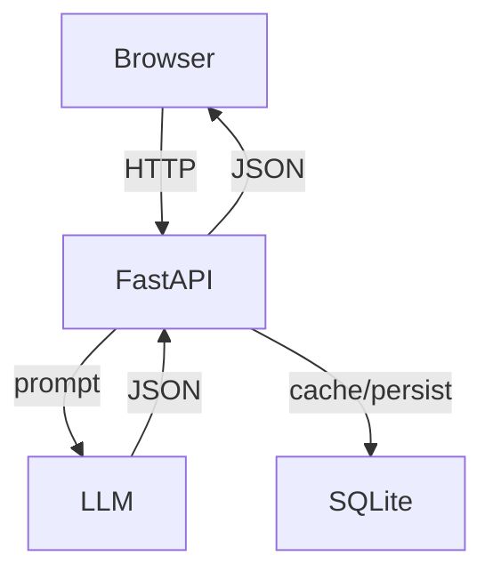
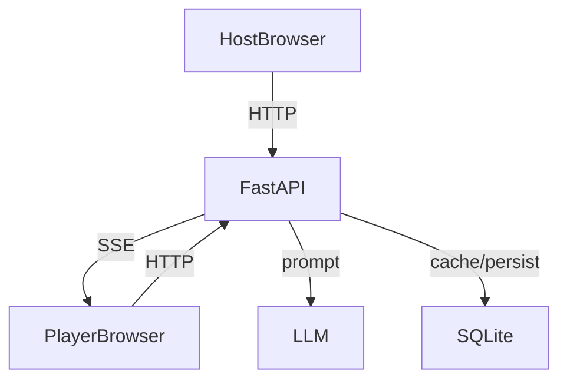

# Architecture

## High-Level Components
- **Frontend** (templates + JS modules): renders UI, manages client state, calls the API.
- **Backend** (FastAPI): serves templates/static files, orchestrates LLM calls, handles live-quiz state.
- **LLM Provider** (OpenAI-compatible): generates categories, questions, explanations.
- **SQLite**: stores generated questions, caches, prompt history, and error logs.

## Request Flow (Classic Trivia)

## Request Flow (Live Quiz)

## Key Backend Modules
- [server.py](server.py): app setup, routing, templates, lifecycle hooks.
- [routes.py](routes.py): classic trivia API endpoints.
- [live_quiz_routes.py](live_quiz_routes.py): live quiz endpoints and SSE.
- [generative.py](generative.py): LLM call wrapper with retry/limits.
- [database.py](database.py): SQLite schema and persistence.
- [preload.py](preload.py): background preloading jobs.
- [utils.py](utils.py): prompt building, validation, JSON parsing.

## Data Stores
- SQLite file: [questions.db](questions.db)
- In-memory live quiz state: [state.py](state.py)
- Pickled state snapshot: [game_state.pickle](game_state.pickle)
