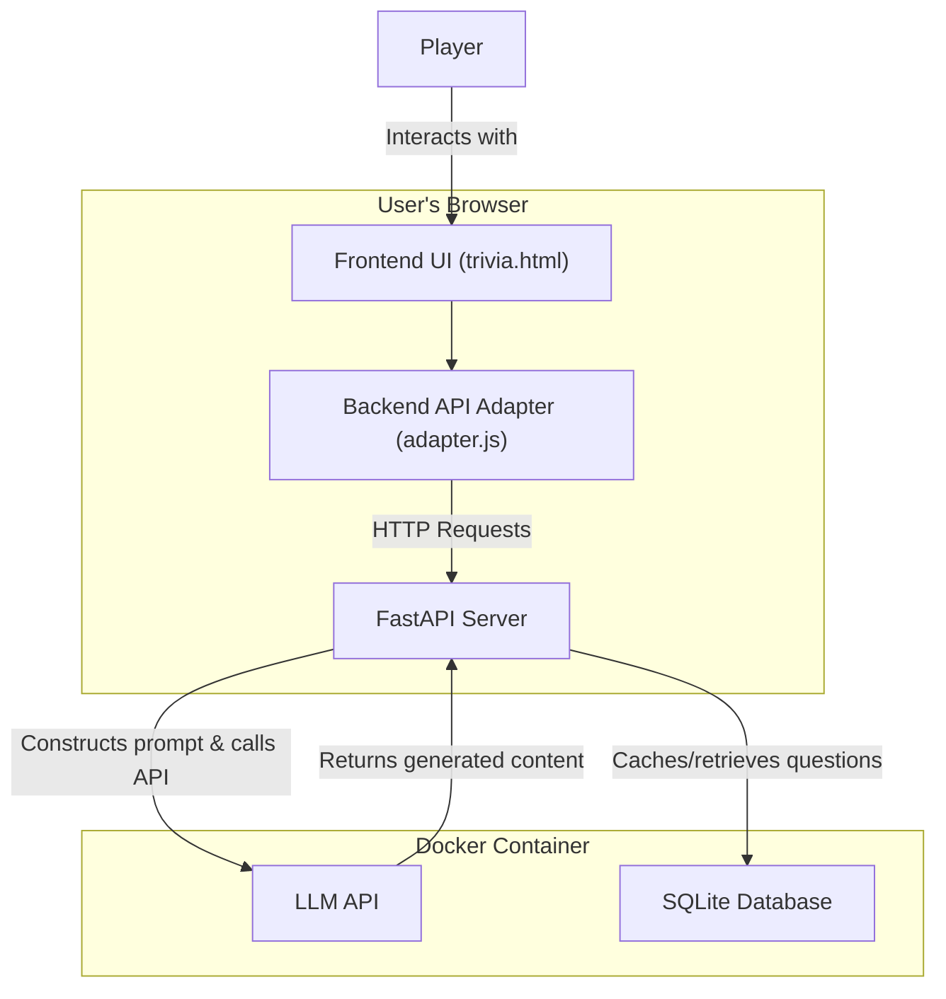

# Trivia LLM Game

A dynamic, multiplayer trivia board game powered by Large Language Models. This application generates unique questions, categories, and explanations on-the-fly, offering a fresh experience in every playthrough. The game is containerized with Docker for easy setup and deployment.

-----

## Features

  * **Dynamic Content Generation**: All trivia content (categories, questions, explanations) is generated in real-time by an LLM, ensuring no two games are the same.
  * **Customizable Games**: Set a theme for the game (e.g., "Lord of the Rings," "80s Pop Culture") to generate tailored categories and questions.
  * **Multiple Game Modes**: Supports both multiple-choice and short-answer questions.
  * **Adjustable Difficulty**: Choose from Basic, Intermediate, and Expert knowledge levels to match the players' expertise.
  * **Category Mutation**: After a player masters a category, it can "mutate" into a new, thematically related category to keep the game challenging.
  * **Multiplayer Support**: Play with 1 to 10 players locally.
  * **Questions database**: Generated questions are saved to a SQLite database.
  * **Progressive Web App (PWA)**: "Installable" on your device for an app-like experience with offline capabilities.
  * **Save & Load**: Game progress is automatically saved to local storage and can be manually downloaded or uploaded.

-----

## How It Works

The application consists of two main components:

1.  **Frontend**: A vanilla JavaScript single-page application that renders the game board, manages player interactions, and handles all game state logic. It communicates with the backend via a set of API endpoints.
2.  **Backend**: A Python server built with **FastAPI**. It serves the frontend files and provides an API that interfaces with an OpenAI-compatible Large Language Model. The backend is responsible for constructing detailed prompts, calling the LLM API, and parsing the responses into a structured format for the game.

### Architecture Diagram



-----

## Getting Started

This project is designed to be run with Docker and Docker Compose for a simple setup.

### Prerequisites

  * [Docker](https://www.docker.com/products/docker-desktop)
  * [Docker Compose](https://docs.docker.com/compose/install/)

### Installation & Launch

1.  **Clone the Repository**

    ```bash
    git clone <your-repository-url>
    cd trivia-llm-docker
    ```

2.  **Configure Environment Variables**
    Create a `.env` file by copying the template:

    ```bash
    cp .env_template .env
    ```

    Now, edit the `.env` file with your credentials:

    ```env
    # Your key for the LLM API
    OPENAI_API_KEY="sk-XXXXXXXXXXXXXXXXXXXX"

    # The base URL of your OpenAI-compatible API endpoint
    # (e.g., a local LLM server like LM Studio, Ollama, or a cloud provider)
    OPENAI_API_BASE="http://host.docker.internal:8080/v1"

    # Set to "true" to enable verbose logging in the server console
    DEBUG=false
    ```

    > **Note:** When connecting to a local LLM server from within the Docker container, use `host.docker.internal` instead of `localhost` for the `OPENAI_API_BASE` address.

3.  **Build and Run with Docker Compose**
    From the root directory of the project, run:

    ```bash
    docker-compose up --build
    ```

    This command will build the Docker image and start the container.

4.  **Access the Game**
    Open your web browser and navigate to:
    **http://localhost:8000**

-----

## Configuration

### `models.json`

This file defines the LLM models available in the game's setup screen. You can add or remove models to match what your API provider supports.

  * `question_models`: Models used for generating trivia questions.
  * `explanation_models`: Complex models used for analyzing player wrong answers.
  * `category_models`: Models used for generating categories and mutations.
  * `fallback_model`: A model to fall back on if the primary choice fails.

### `prompts.json`

This file contains the detailed "meta-prompts" or system prompts used to instruct the LLM on how to generate content. You can modify these prompts to change the tone, style, or structure of the generated trivia.